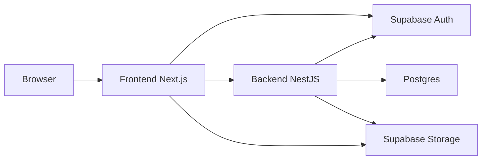

# Prism - Task Manager

[NestJS](https://nestjs.com/)
[Next.js](https://nextjs.org/)
[Supabase](https://supabase.com/)
[Prisma](https://www.prisma.io/)
[Docker](https://docs.docker.com/compose/)

Aplicação web moderna desenvolvida para o gerenciamento eficiente de tarefas no dia a dia, combinando a simplicidade de uma lista de tarefas (*to-do list*) intuitiva com recursos avançados de rastreamento e organização inspirados em ferramentas profissionais de gestão de projetos. O sistema conta com autenticação segura, customização de preferências diretamente na conta e um painel dinâmico com visualização flexível em modo lista ou kanban, oferecendo suporte completo a status, prioridade, prazos (*deadlines*) e anexos de arquivos. Contando com um controle de acesso robusto baseado em papéis (RBAC), usuários comuns gerenciam exclusivamente o próprio trabalho, enquanto administradores possuem visão global da plataforma, incluindo permissão para listar tarefas de qualquer usuário e gerenciar papéis de acesso.

---

## Visão Geral

O ecossistema foi desenhado com uma clara separação de responsabilidades em três frentes principais que trabalham de forma integrada:


| **Camada**   | **Responsável**                     | **Papel no Sistema**                                                                                                                            |
| ------------ | ----------------------------------- | ----------------------------------------------------------------------------------------------------------------------------------------------- |
| **Dados**    | Supabase Auth, Storage e PostgreSQL | Atua como a fundação de dados e identidade, gerenciando o ciclo de autenticação, o banco relacional e o armazenamento seguro de blobs.          |
| **Backend**  | NestJS                              | Centraliza as regras de negócio, o controle de acesso baseado em papéis (RBAC), as operações de CRUD de tarefas e o gerenciamento de metadados. |
| **Frontend** | Next.js & TanStack Query            | Fornece a interface do usuário (UI), gerencia a sessão ativa no navegador e orquestra o fluxo de uploads e requisições autenticadas.            |


### Fluxo de Comunicação

A integração entre as pontas ocorre de maneira segura e desacoplada: o navegador interage diretamente com o **Supabase Auth** para autenticar o usuário e obter o token de acesso (`JWT`). Em seguida, o **Frontend (Next.js)** envia este *access token* via cabeçalho Bearer para a **API (NestJS)**.

O backend atua como um *resource server*, validando o token, resolvendo o perfil do usuário e aplicando rigorosamente as regras de autorização. Para arquivos e anexos, o fluxo é otimizado: os binários vão direto para o **Supabase Storage**, enquanto a API valida e controla estritamente as permissões de quem pode associar qual arquivo a uma tarefa específica.

---

## Como executar

**Pré-requisitos:** Node.js ≥ 20 e Yarn 1.x, **ou** Docker Desktop / Compose.

As variáveis reais (Supabase, banco, etc.) **não** estão no Git. Elas serão enviadas **por e-mail** como arquivos `.env` prontos. Os `.env.example` do repositório só listam as chaves com placeholders.


| Ambiente | Arquivo            | Usado por                            |
| -------- | ------------------ | ------------------------------------ |
| Local    | `.env` na **raiz** | Backend                              |
| Local    | `apps/client/.env` | Frontend                             |
| Docker   | `.env` na **raiz** | Backend + build args `NEXT_PUBLIC_`* |


> Não existe `.env` em `apps/api`. A env da API é a da raiz do monorepo.

### Desenvolvimento local (`yarn:dev`)

1. Coloque o `.env` do backend (e-mail) na **raiz** do projeto.
2. Coloque o `.env` do frontend (e-mail) em `apps/client/.env`.
3. Suba o monorepo:

```bash
yarn install
yarn dev
```


| Serviço  | URL                                                      |
| -------- | -------------------------------------------------------- |
| Frontend | [http://localhost:3000](http://localhost:3000)           |
| Backend  | [http://localhost:3001](http://localhost:3001)           |
| Swagger  | [http://localhost:3001/docs](http://localhost:3001/docs) |


### Docker Compose

1. Coloque o `.env` da raiz (e-mail) na **raiz** do projeto.
2. Suba os containers:

```bash
docker compose up --build -d
```


| Serviço  | Container             | URL                                                      |
| -------- | --------------------- | -------------------------------------------------------- |
| Frontend | `task-manager-client` | [http://localhost:3000](http://localhost:3000)           |
| Backend  | `task-manager-api`    | [http://localhost:3001](http://localhost:3001)           |
| Swagger  | `task-manager-api`    | [http://localhost:3001/docs](http://localhost:3001/docs) |


Portas padrão: `CLIENT_PORT=3000`, `API_PORT=3001` (ajustáveis no `.env` da raiz).

### Contas de teste


| Papel  | E-mail            | Senha          |
| ------ | ----------------- | -------------- |
| COMMON | `common@test.com` | `password@123` |
| ADMIN  | `admin@test.com`  | `password@123` |


---

## Arquitetura (monorepo)

```
apps/client/           # Frontend — Next.js
apps/api/              # Backend — NestJS + Prisma
packages/shared-types/ # Contratos TypeScript / Zod compartilhados
```

O ecossistema do projeto foi estruturado como um **Monorepo** gerenciado unificadamente via **Yarn Workspaces**, permitindo que aplicações independentes e pacotes compartilhados convivam no mesmo repositório com alta coesão e compartilhamento seguro de contratos.




---

## Decisões técnicas

### Supabase Auth

Pelo Supabase Auth, a autenticação é um problema resolvido: cadastro, sessão, refresh de token e logout têm requisitos de segurança altos e pouco valor diferencial neste desafio. O client usa o SDK do Supabase para o ciclo de auth e envia apenas o access token (Bearer) para a API. A API atua como resource server: valida o JWT via JWKS, resolve o Profile e aplica autorização. A API não armazena senhas nem implementa sessão.

No cadastro, a política de senha (OWASP: comprimento, maiúscula, minúscula, dígito e caractere especial) é validada na API antes do signUp. No client, um interceptor faz silent refresh com fila single-flight em caso de 401, evitando logout prematuro enquanto houver refresh_token válido.

### Postgres (Supabase) + Prisma

O domínio exige um modelo relacional forte e alta integridade de dados. A escolha pelo Postgres no ecossistema do Supabase evita a complexidade de gerenciar múltiplos serviços e permite que o `Profile.id` mapeie diretamente para o `auth.users` de forma nativa e segura. Para interagir com ele, escolhi o Prisma ORM por oferecer tipagem estrita de ponta a ponta e um modelo declarativo que isola o SQL cru, garantindo queries previsíveis. Além disso, o Prisma se encaixa perfeitamente na arquitetura ao suportar uma URL com connection pooling para o runtime da API e uma URL direta dedicada para migrations. Na prática, o modelo relacional é previsível e as migrations do repositório já vêm aplicadas no banco do projeto, garantindo que o ambiente suba pronto para uso.

### Supabase Storage

Avatares e anexos são blobs e guardá-los diretamente no banco relacional não é uma boa prática, pois incha o banco de dados, degrada a performance e complica os limites de payload. Para resolver isso, utilizei o Supabase Storage (que funciona por debaixo dos panos como um S3 da AWS) para assumir o upload e o download dos arquivos, enquanto a API e o client gerenciam apenas os metadados e as regras de autorização de cada arquivo. Como o Supabase fornece esse serviço de storage de forma gratuita e integrada, ele se encaixou perfeitamente para atender a este projeto de escopo menor sem adicionar complexidade extra de infraestrutura.

### NestJS

A escolha pelo NestJS deu-se pelo fato de ser um framework robusto em TypeScript que permite utilizar a mesma linguagem em todo o ecossistema e integrar perfeitamente com o monorepo via Yarn Workspaces, garantindo tipagem e contratos compartilhados de ponta a ponta. Além disso, por configurar diversos aspectos estruturais por baixo dos panos, como arquitetura modular por contexto (`auth`, `users`, `tasks`), validação rigorosa de DTOs, *guards* de segurança e documentação integrada, ele impacta positivamente na Experiência do Desenvolvedor (DX) e faz com que o trabalho flua de forma natural e organizada. Na prática, o framework atende perfeitamente às demandas de gerenciamento de papéis, *ownership* e filtros avançados. Isso significa que todas as regras sensíveis de negócio (como a restrição de `scope=all` exclusiva para ADMIN e a validação de que um usuário só pode alterar ou excluir as suas próprias tarefas) são aplicadas de forma segura e estrita diretamente no servidor, restando à interface do usuário apenas refletir essas permissões.

### Next.js + TanStack Query

A escolha pelo Next.js deu-se por ser um framework de frontend moderno e robusto que, alinhado ao uso do TypeScript no monorepo, compartilha da mesma base tecnológica da API, garantindo alta coesão no projeto. A escolha da arquitetura de App Router e de *client components* para cobrir as telas autenticadas trouxe uma estrutura altamente organizada, intuitiva e limpa de se ler. Para potencializar essa experiência, adicionei o TanStack Query para gerenciar o estado assíncrono, padronizar o cache de dados de perfil e tarefas, e simplificar a limpeza de estados. Na prática, essa combinação otimiza o cache, garante persistência eficiente e entrega uma Experiência do Usuário (UX) superior, enquanto preferências visuais e funcionais (como tema, contraste e formato de data) são centralizadas e persistidas diretamente no perfil do usuário.

### Shared-types + monorepo

A decisão de estruturar o projeto como um monorepo gerenciado via Yarn Workspaces deu-se pela necessidade de manter alta coesão e compartilhamento seguro de contratos entre o frontend e o backend. Para evitar a duplicação manual de enums, interfaces e DTOs — o que frequentemente gera inconsistências em filtros, preferências e shapes de resposta —, criei o pacote isolado `@task-manager/shared-types`. Na prática, essa abordagem garante tipagem estrita de ponta a ponta em todo o ecossistema, permitindo versionar os contratos de forma unificada junto com as aplicações e elevando drasticamente a manutenibilidade e a segurança do código.

### Docker

A escolha por conteinerizar a aplicação utilizando imagens Alpine com *multi-stage builds* (compilando o NestJS e utilizando o build *standalone* do Next.js) garante imagens finais extremamente enxutas, seguras e otimizadas. Essa abordagem foi adotada por ser uma excelente prática de engenharia que elimina definitivamente o clássico problema de "não funciona na minha máquina", garantindo total consistência e previsibilidade do ambiente. Na prática, o Docker Compose sobe de forma integrada os containers `task-manager-api` e `task-manager-client`, permitindo que a banca avaliadora reproduza todo o ecossistema localmente com um único comando, além de servir como uma base sólida e pronta para eventuais deploys futuros.

---

## Uso de Inteligência Artificial

O uso de Inteligência Artificial ao longo do projeto foi uma ferramenta essencial para acelerar o desenvolvimento, mantendo sempre o rigor técnico sob meu controle. Utilizei o **Cursor** para o backend, novas features, testes, Docker e refinamentos, e o **v0** para a estruturação inicial da UI.

O fluxo de trabalho seguiu uma abordagem estruturada: utilizei o modo de Planejamento do Cursor para desenhar o escopo técnico antes de cada implementação, e a partir do plano aprovado, pedi para construir o código base. Em seguida, fiz a revisão minuciosa de tudo o que foi gerado, ajustando funções manualmente sempre que necessário. No front-end, o projeto começou no v0 a partir de um prompt com referências visuais e diretrizes de interface globais, cujos arquivos foram baixados para o repositório e, a partir daí, seguiram o mesmo fluxo do Cursor aplicado na API. Os testes também foram gerados com auxílio de IA, mas todos os casos de teste e os resultados de execução foram rigorosamente conferidos por mim.

Em suma, embora a maior parte do código tenha sido gerada com o apoio da inteligência artificial, as decisões de arquitetura e produto, o aceite do que entra de fato no repositório e a responsabilidade total pela solução funcional são minhas.

---

## Screencast

Vídeo de demonstração do sistema e dos principais pontos da implementação:

_[inserir link aqui]_
